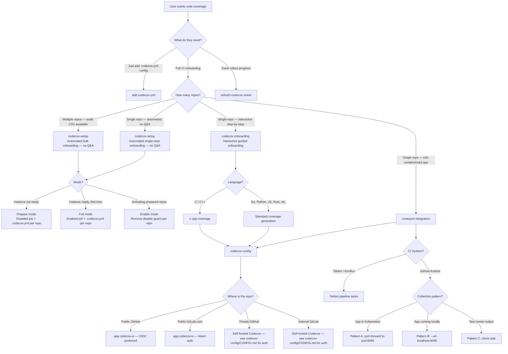

# Coverage Skills Decision Tree

```mermaid
graph TD
    A[User wants code coverage] --> AA{What do they need?}

    AA -->|Just add .codecov.yml config| AB[add-codecov-yml]
    AA -->|Full CI onboarding| B{How many repos?}
    AA -->|Track rollout progress| AC[refresh-codecov-sheet]

    B -->|Multiple repos — audit CSV available| C[codecov-setup\nAutomated bulk onboarding — no Q&A]
    B -->|Single repo — automated, no Q&A| D[codecov-setup\nAutomated single-repo onboarding — no Q&A]
    B -->|Single repo — interactive step-by-step| E[codecov-onboarding\nInteractive guided onboarding]
    B -->|Single repo — e2e containerized app| F[coverport-integration]

    C --> G{Mode?}
    G -->|Instance not ready| H[Prepare mode\nDisabled job + .codecov.yml per repo]
    G -->|Instance ready, first time| I[Full mode\nEnabled job + .codecov.yml per repo]
    G -->|Activating prepared repos| J[Enable mode\nRemove disable guard per repo]

    D --> G

    E --> K{Language?}
    K -->|C / C++| L[c-cpp-coverage]
    K -->|Go, Python, JS, Rust, etc.| M[Standard coverage generation]

    L --> N[codecov-config]
    M --> N
    F --> N

    F --> O{CI System?}
    O -->|Tekton / Konflux| P[Tekton pipeline tasks]
    O -->|GitHub Actions| Q{Collection pattern?}

    Q -->|App in Kubernetes| R[Pattern A: port-forward to pod:9095]
    Q -->|App running locally| S[Pattern B: --url localhost:9095]
    Q -->|Test runner output| T[Pattern C: client-side]

    N --> U{Where is the repo?}
    U -->|Public GitHub| V[app.codecov.io — OIDC preferred]
    U -->|Public GitLab.com| V2[app.codecov.io — token auth]
    U -->|Private GitHub| W[Self-hosted Codecov — see codecov-config/CONFIG.md for auth]
    U -->|Internal GitLab| X[Self-hosted Codecov — see codecov-config/CONFIG.md for auth]
```
