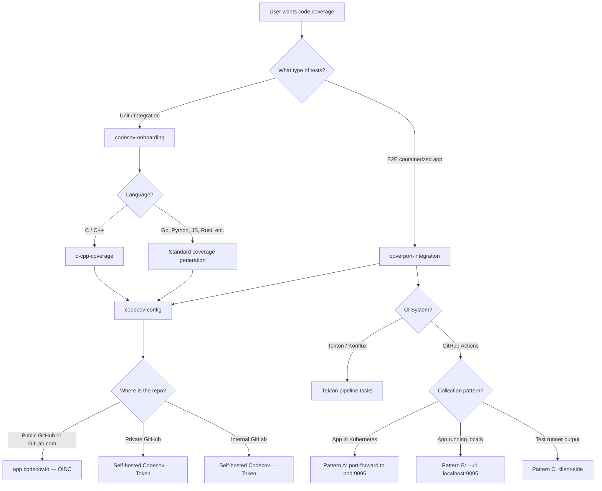

# Coverage Skills Decision Tree

```mermaid
graph TD
    A[User wants code coverage] --> B{What type of tests?}

    B -->|Unit / Integration| C[codecov-onboarding]
    B -->|E2E containerized app| D[coverport-integration]

    C --> E{Language?}
    E -->|C / C++| F[c-cpp-coverage]
    E -->|Go, Python, JS, Rust, etc.| G[Standard coverage generation]

    F --> H[codecov-config]
    G --> H
    D --> H

    D --> I{CI System?}
    I -->|Tekton / Konflux| J[Tekton pipeline tasks]
    I -->|GitHub Actions| K{Collection pattern?}

    K -->|App in Kubernetes| L[Pattern A: port-forward to pod:9095]
    K -->|App running locally| M[Pattern B: --url localhost:9095]
    K -->|Test runner output| N[Pattern C: client-side]

    H --> O{Where is the repo?}
    O -->|Public GitHub or GitLab.com| P[app.codecov.io — OIDC]
    O -->|Private GitHub| Q[Self-hosted Codecov — Token]
    O -->|Internal GitLab| R[Self-hosted Codecov — Token]
```
